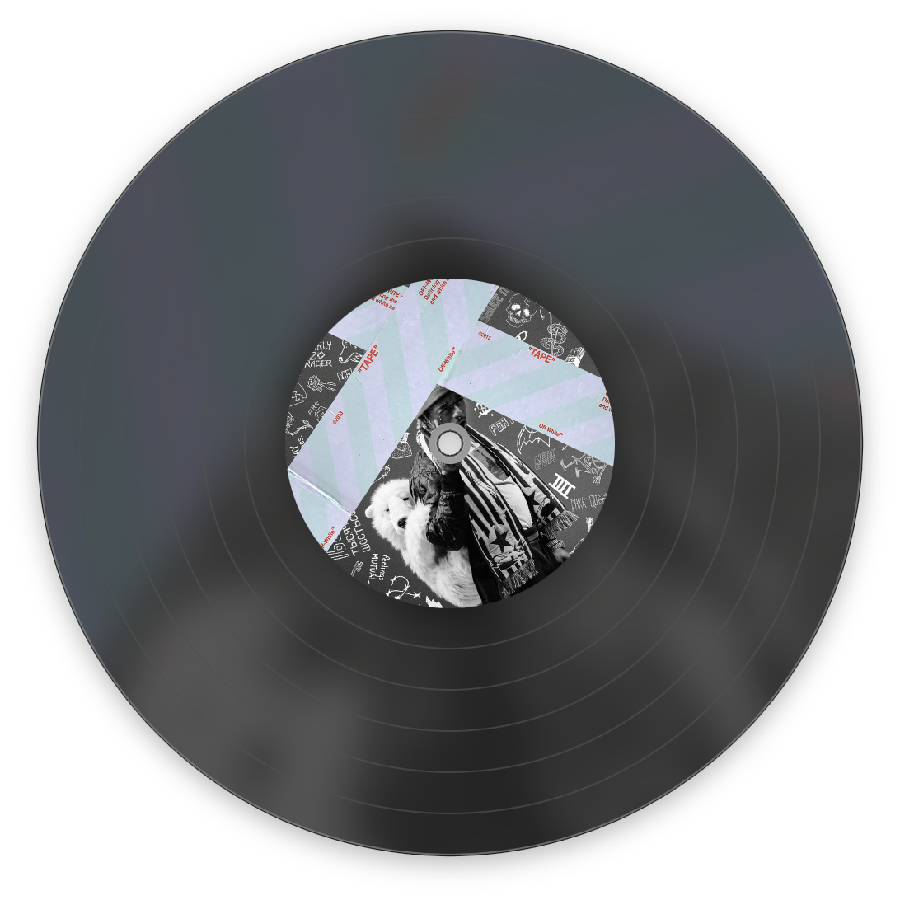
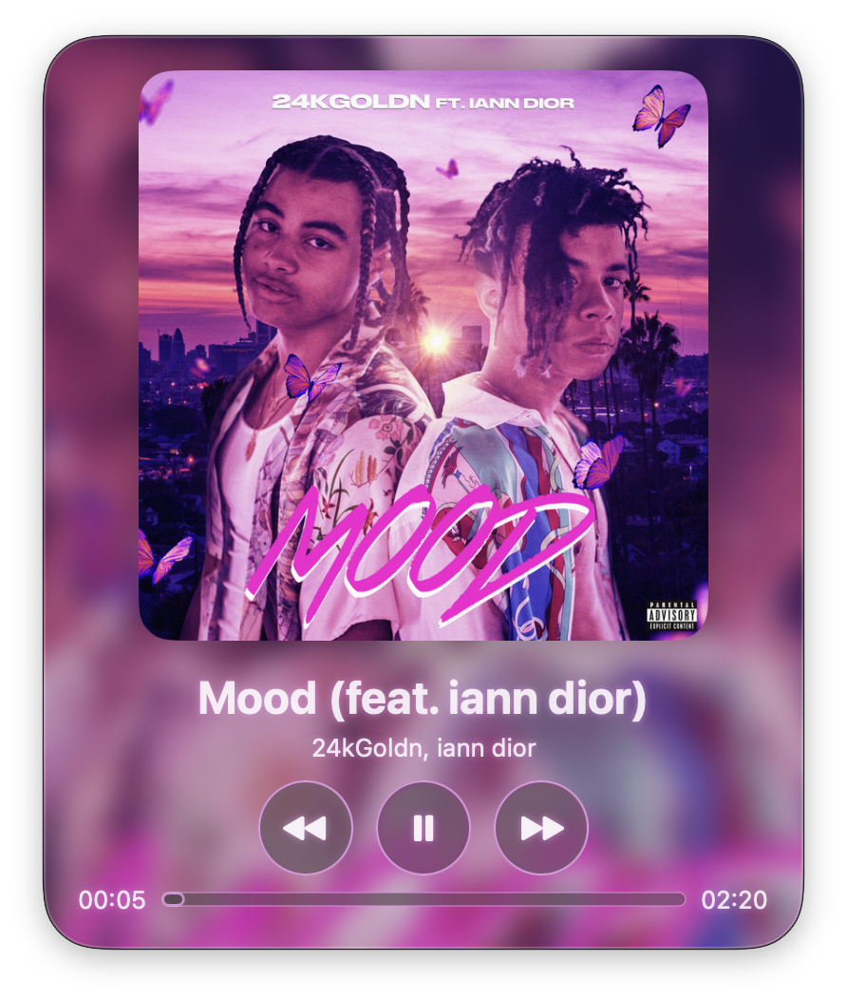
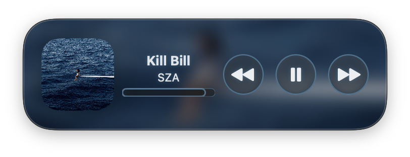

# Pulse

Pulse is a modern macOS music player built with SwiftUI that integrates with Spotify to provide a beautiful native desktop listening experience.


<p align="center">
  <a href="https://github.com/608-N8/Pulse/releases/latest">
    
  </a>
</p>

## Features

- 🎵 Spotify playback controls
- 💿 Animated record player
- 🎨 Dynamic album artwork backgrounds
- 🌈 Adaptive color theming
- 📜 Lyrics view
- 📈 Playback progress slider
- 🪟 Native macOS SwiftUI interface
- ⚡ Lightweight and responsive

## Screenshots

<table>
  <tr>
    <td align="center">
      <strong>Mini Player</strong><br><br>
      
    </td>
    <td align="center">
      <strong>Record Player</strong><br><br>
      
    </td>
  </tr>
  <tr>
    <td align="center">
      <strong>Full Player</strong><br><br>
      
    </td>
    <td align="center">
      <strong>Compact Player</strong><br><br>
      
    </td>
  </tr>
</table>

## Requirements

- macOS 15.6+
- Xcode 26+
- Spotify Premium account
- Spotify Developer application

## Installation

Clone the repository:

```bash
git clone https://github.com/608-N8/Pulse.git
```

Open:

```
Pulse.xcodeproj
```

Build and run.

## Spotify Setup

Pulse requires your own Spotify Developer application.

Create one at:

https://developer.spotify.com/dashboard

Then configure your Client ID in the project.

> Never commit your Client Secret.

## Roadmap

- [ ] Queue support
- [ ] Volume control
- [ ] Mini Player improvements
- [ ] Playlist browsing
- [ ] Apple Music support (planned)

## Contributing

Pull requests and suggestions are welcome.

## License

MIT License
